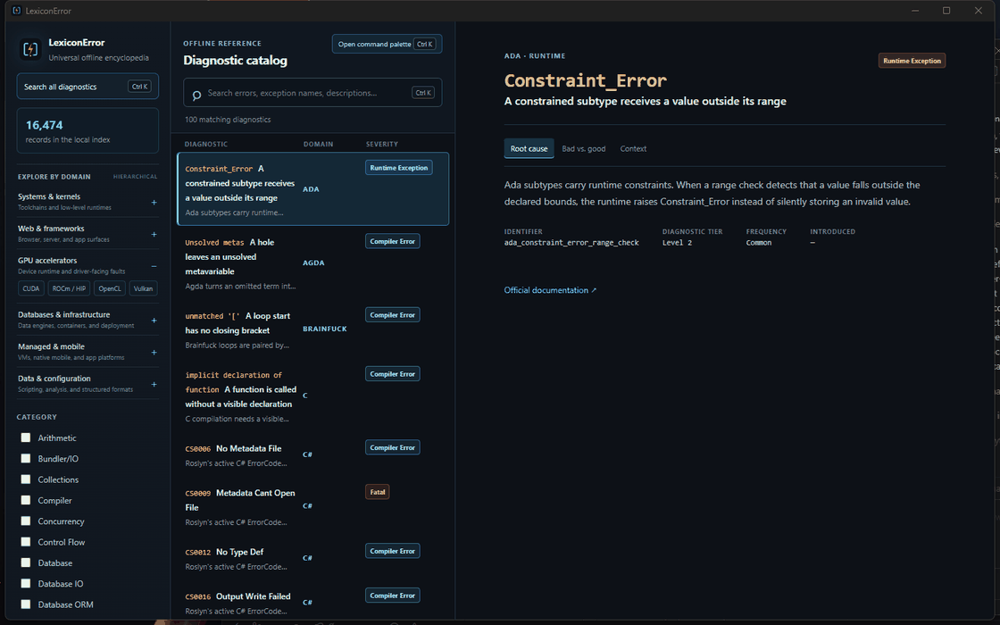
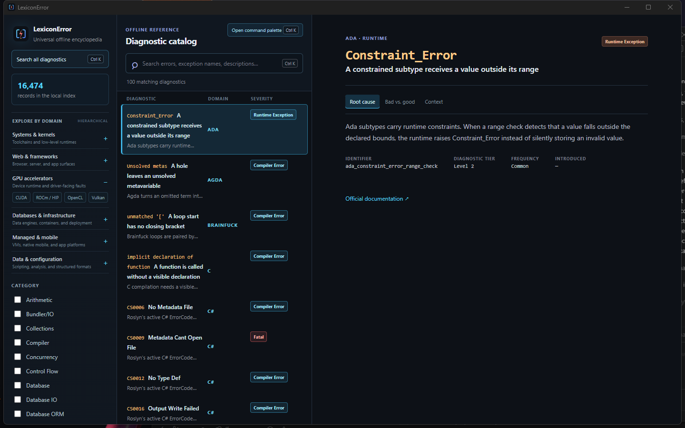
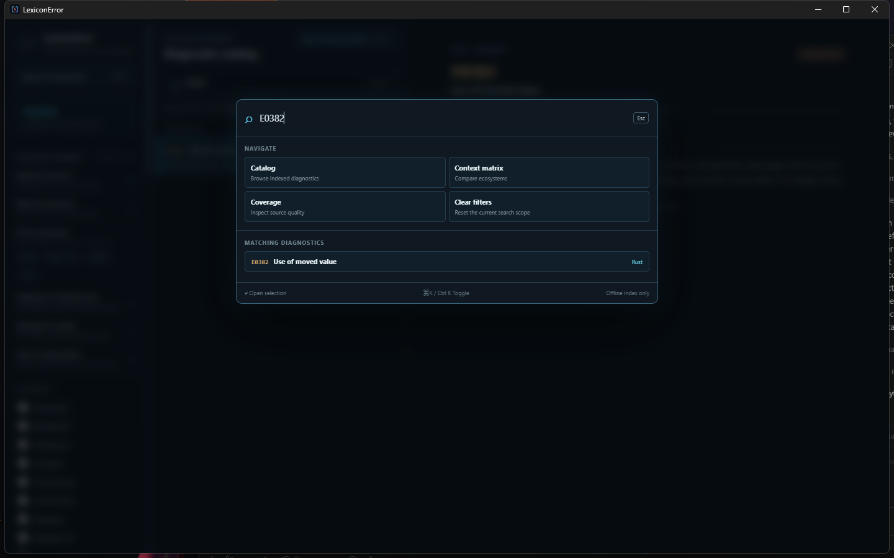
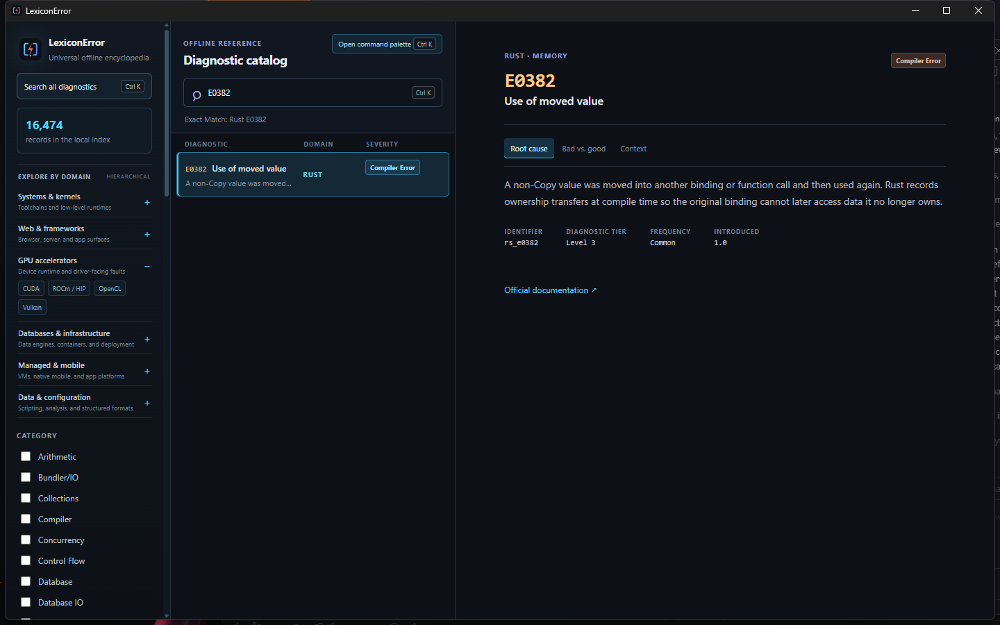
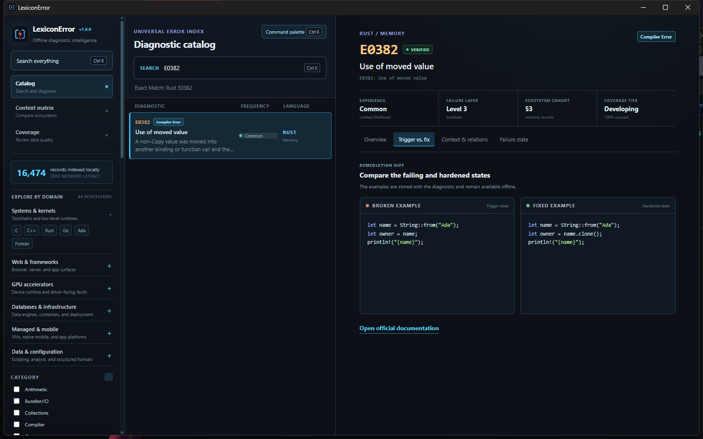
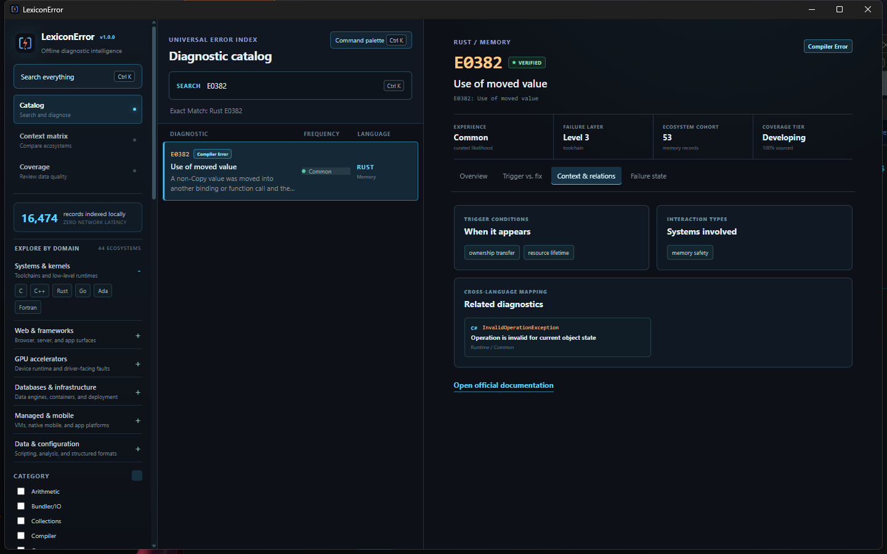
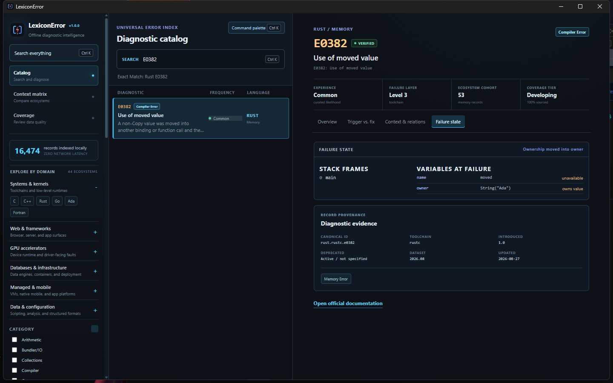

# LexiconError

  

<strong>An offline-first diagnostic atlas for programming languages, infrastructure, and GPU runtimes.</strong>

Tauri 2 | React | TypeScript | Rust | SQLite FTS5 | Python ingestion

<strong>Current desktop release: <a href="docs/releases/v1.0.0.md">v1.0.0</a></strong>

## Project links

| Destination | Link |
| --- | --- |
| GitHub repository | [theworker02/lexicon-error](https://github.com/theworker02/lexicon-error) |
| Windows releases | [Download the latest desktop release](https://github.com/theworker02/lexicon-error/releases/latest) |
| Hugging Face dataset | [Magnexis/lexiconerror-diagnostics](https://huggingface.co/datasets/Magnexis/lexiconerror-diagnostics) |
| Router Small | [Magnexis/lexiconerror-router-small](https://huggingface.co/Magnexis/lexiconerror-router-small) |
| Router Medium | [Magnexis/lexiconerror-router-medium](https://huggingface.co/Magnexis/lexiconerror-router-medium) |
| Router Large | [Magnexis/lexiconerror-router-large](https://huggingface.co/Magnexis/lexiconerror-router-large) |
| GitHub Pages | [LexiconError web preview](https://theworker02.github.io/lexicon-error/) |

## Overview

LexiconError is a local-first desktop encyclopedia for compiler diagnostics, linter rules, runtime exceptions, configuration failures, and accelerator-runtime faults. It makes each error searchable alongside its root cause, minimum trigger, hardened repair, version context, source provenance, and conceptual equivalents in other ecosystems.

It is a reference system, not an execution environment. The application never executes the snippets it displays, collects telemetry, opens a localhost API, or uploads pasted diagnostic text.

## Why LexiconError exists

Compiler and runtime documentation is usually organized around one language, one toolchain, or one release line. Real projects rarely stay inside those boundaries. A desktop application may involve TypeScript, a native build tool, SQL, Docker, a CI configuration, and a CUDA or ROCm workload at the same time. Searching each source independently makes it difficult to compare failure modes, preserve useful examples, or work without a network connection.

LexiconError provides one normalized local reference while retaining the distinctions that matter:

- Official diagnostic identifiers are kept separate from human-readable titles.
- Severity, frequency, and taxonomy tier are independent fields rather than one vague priority score.
- Curated entries and generated registry imports expose different verification states.
- Source provenance remains attached to the diagnostic instead of being discarded during ingestion.
- Triggering code and hardened code are stored side by side.
- Related diagnostics can connect comparable concepts across languages without pretending their runtime semantics are identical.
- The desktop application, portable SQLite index, Hugging Face dataset, and routing models are separate outputs built from the same normalized knowledge layer.

The result is useful as an offline encyclopedia, a source-aware search index, an ingestion project, a retrieval corpus, and a foundation for developer tooling.

## See it in action

  

  <a href="docs/media/lexiconerror-search-demo.mp4">Watch the 1120×700 H.264 demo video</a>

<strong>Open full-resolution screenshots</strong>

### Offline diagnostic catalog

### Global command palette

### Root-cause inspector

### Trigger-versus-fix workspace

### Context and cross-language relationships

### Failure-state inspector

## Product surface

| Surface | What it provides |
| --- | --- |
| Command palette | Ctrl+K / Cmd+K instant offline search across codes, names, explanations, and language metadata. |
| Diagnostic catalog | FTS-ranked compact grid with language, category, severity, frequency, and interaction filters. |
| Inspector | Four interactive workspaces for root-cause analytics, frequency and domain graphs, trigger-versus-fix code, situational context, related diagnostics, state snapshots, and provenance. |
| Context matrix | Cross-language frequency view for comparing diagnostic domains. |
| Coverage dashboard | Database-derived counts, source coverage, verification state, examples, fixes, and release tier. |
| Local contributions | Validated JSON or Markdown/YAML frontmatter imports from a user-selected directory. |
| Backups and exports | Portable SQLite backup plus JSONL, JSON, CSV, coverage, and release-manifest exports. |

## Desktop workflow

1. Open the catalog or press `Ctrl+K` / `Cmd+K` from anywhere in the application.
2. Search with an official code such as `E0382`, an exception such as `KeyError`, a message fragment, a language name, or a pasted diagnostic.
3. Narrow the local result set by ecosystem, category, severity, curated frequency, or interaction type.
4. Inspect the root cause and the selected record's verification status before relying on its remediation.
5. Compare the trigger and hardened examples in the remediation workspace.
6. Review situational conditions, related cross-language diagnostics, and any curated failure-state snapshot.
7. Follow the official source link when current upstream behavior or version-specific accuracy matters.

The context matrix is useful when the starting point is a failure domain rather than an exact code. The coverage dashboard answers a different question: how complete and well sourced is each ecosystem in the current local release?

## Understanding the analytics

LexiconError deliberately avoids presenting invented real-world incident percentages. The inspector separates two kinds of information:

- **Curated experience likelihood** is an ordinal classification: `Common`, `Uncommon`, `Rare`, or `Situational`.
- **Catalog distribution** is computed from the local SQLite database and shows how many indexed records in the selected ecosystem belong to each frequency or failure-domain bucket.

Clicking a frequency bar applies that frequency while retaining the selected language. Clicking a failure-domain bar opens the corresponding ecosystem/category cohort. These controls query real indexed records; they are not static illustrations.

Frequency does not imply severity. A common compiler error can be harmless because it is rejected before execution, while a situational allocator or device fault may terminate a workload or corrupt state. Verification status is also separate: a record may be sourced from an official registry while its explanation and repair remain marked `Needs Review`.

## Diagnostic contract

Every renderer entry has this stable core:

~~~
id, language, code, category, severity, title, description,
bad_example, good_example, version_introduced, version_deprecated,
source_url/source_reference, tier, frequency, situational_context,
interaction_types, related_errors, state_snapshot
~~~

The normalized knowledge layer adds tool identity, canonical identifier, classifications, fingerprint, provenance, and verification state. Source_reference is a supported input alias and is normalized to source_url. The exact contribution schema is [data/error-entry.schema.json](data/error-entry.schema.json).

## Four-tier taxonomy

| Tier | Scope | Examples |
| --- | --- | --- |
| 1 | Surface and syntax | Delimiters, indentation, parser failures, basic type mismatches. |
| 2 | Logic and runtime | Null dereference, bounds checks, promise failures, argument validation. |
| 3 | Compiler, linker, and static analysis | Type resolution, missing symbols, lint rules, ABI, and build diagnostics. |
| 4 | Situational systems behavior | Undefined behavior, deadlocks, allocator/device failures, and architecture-specific faults. |

Frequency and severity remain independent: a rare device fault can be critical, while a common lint rule may be low impact.

## Current catalog

The 2026.08 catalog contains **16,474 records** across **44 languages** and **45 tools**.

Core coverage includes Python, JavaScript, TypeScript, C#, Java, C, C++, Go, Rust, Zig, Kotlin, Swift, Dart, PHP, Ruby, Elixir, Scala, Clojure, R, Lua, Bash, SQL, JSON, YAML, and related ecosystems.

The registry and runtime pipeline includes rustc and Clippy, Roslyn and .NET runtime, CPython, TypeScript, javac, Clang, Node.js, V8, SpiderMonkey, Go, Kotlin, SQLite, and R. Infrastructure and accelerator coverage includes Docker, Kubernetes, Terraform, PostgreSQL, MongoDB, Redis, GraphQL, CUDA, ROCm/HIP, Vulkan, and OpenCL where curated or staged.

Generated registry records remain **Needs Review** until an editor supplies source-backed explanation, reproducible trigger, repair guidance, and version context. Record volume never implies editorial verification.

## Architecture

~~~
React + TypeScript desktop UI
        | validated Tauri IPC
Rust local application core
        |
SQLite + FTS5 entries and knowledge metadata
        |
Python source adapters -> normalization -> validation -> release index
~~~

The desktop application has no HTTP listener. Renderer calls are explicit, validated IPC commands; imported contribution files pass schema and backend validation before insertion.

## Repository layout

~~~
assets/branding/    Original reusable LexiconError SVG mark
src/                React desktop interface
src-tauri/          Rust commands, SQLite setup, Tauri configuration
data/               Curated seed, review queues, schemas, knowledge profiles
ingestion/          Parsers, organizers, validators, release/export scripts
scripts/            Reproducible product-media capture utilities
contributions/      Example local contribution files
artifacts/          Generated release indexes, ignored by Git
hf/                 Dataset and static Space publication packages
.github/            Funding, community, issue, PR, and validation configuration
~~~

## Local development

### Prerequisites

- Node.js 20 or newer
- Rust stable
- Python 3.11 or newer
- Tauri 2 prerequisites for the target platform

### Install and run

~~~powershell
npm.cmd install
npm.cmd run desktop:dev
~~~

### Validate the desktop application

~~~powershell
npm.cmd run check
npm.cmd run build
cargo test --manifest-path src-tauri\Cargo.toml
~~~

### Build and validate the catalog

The review manifest is the ordered input for a reproducible data build. Release data is stored in artifacts/, never Vite's disposable dist/ directory.

~~~powershell
python ingestion\build_index.py --manifest data\review\manifest.json --output artifacts\lexicon-error-2026.08-reviewed.db
python ingestion\test_pipeline.py --database artifacts\lexicon-error-2026.08-reviewed.db
~~~

### Package native desktop artifacts

~~~powershell
npm.cmd run desktop:build
~~~

On Windows this creates NSIS and MSI bundles under src-tauri/target/release/bundle/. Build on macOS or Linux to create their native bundles; the codebase is cross-platform, but release artifacts must be built for each target.

## v1.0.0 release artifacts

The stable Windows release produces:

| Artifact | Purpose |
| --- | --- |
| `LexiconError_1.0.0_x64-setup.exe` | Recommended interactive Windows x64 installer. |
| `LexiconError_1.0.0_x64_en-US.msi` | Windows Installer package for managed deployment. |
| `lexicon-error-2026.08-reviewed.db` | Portable SQLite/FTS5 reference index. |

The checksums, validation commands, limitations, and human-readable release notes are maintained in [docs/releases/v1.0.0.md](docs/releases/v1.0.0.md). Installers are not checked into the Git repository; they belong in the matching GitHub Release. The portable database is reproducibly generated under `artifacts/` and is also excluded from ordinary source commits.

The application version is defined consistently in `package.json`, `src-tauri/Cargo.toml`, and `src-tauri/tauri.conf.json`. The desktop interface reads the packaged Tauri version at runtime, so the visible version badge reflects the executable rather than a screenshot-only label.

## Local CLI

~~~powershell
.\lexerror.cmd --database artifacts\lexicon-error-2026.08-reviewed.db coverage
.\lexerror.cmd --database artifacts\lexicon-error-2026.08-reviewed.db detect "error[E0382]: borrow of moved value"
.\lexerror.cmd --database artifacts\lexicon-error-2026.08-reviewed.db release-manifest --output artifacts\dataset-manifest.json
.\lexerror.cmd --database artifacts\lexicon-error-2026.08-reviewed.db export --format jsonl --output artifacts\lexicon-error.jsonl
~~~

JSON, JSONL, and CSV exports retain stable IDs and normalized metadata. Paste detection is local-only and redacts secret-bearing lines and obvious local paths before matching.

## Ingestion and provenance

Adapters in [ingestion/sources](ingestion/sources) transform a saved upstream snapshot or installed-tool output into the standardized entry format. Parsers do not perform network calls during normalization. The source lock records upstream URL, reference, retrieval timestamp, size, and SHA-256 hash.

The source registry includes license and redistribution guidance. The public corpus exports derived metadata only; it deliberately excludes raw source snapshots and local contribution directories. MDN-derived data retains page metadata rather than documentation bodies.

The original user-supplied root JSON files, including GPU records, remain unchanged. The organizer creates an auditable report that identifies canonical candidates, existing-diagnostic collisions, and source-less staging. See [data/review/user-import-report.json](data/review/user-import-report.json).

## Contributing diagnostics

Contributions may be JSON, JSONL, or Markdown with YAML frontmatter. Each contribution needs a stable identifier, real trigger, correction, and source provenance where available. Do not create one record for every variable-specific variation of the same diagnostic pattern.

~~~powershell
python ingestion\validate_entries.py path\to\entry.json
python ingestion\organize_user_records.py
~~~

See [CONTRIBUTING.md](CONTRIBUTING.md), [contributions/example.md](contributions/example.md), and [data/error-entry.schema.json](data/error-entry.schema.json). Local contributions remain local until an editor intentionally promotes them into a reviewed release.

## Hugging Face Dataset, model, and Space

The complete published dataset is available directly from Hugging Face:

> **[Magnexis/lexiconerror-diagnostics](https://huggingface.co/datasets/Magnexis/lexiconerror-diagnostics)**

The project also publishes a three-size diagnostic-routing model family and maintains a prepared static Space package:

- [Magnexis/lexiconerror-diagnostics](https://huggingface.co/datasets/Magnexis/lexiconerror-diagnostics): 16,474 JSONL records, Dataset Card, source notices, schema, source lock, and SHA-256 release manifest.
- LexiconError Router model family: three CPU-friendly classifiers that predict language, category, and severity from pasted diagnostics. Choose [Small](https://huggingface.co/Magnexis/lexiconerror-router-small) (2.43M parameters), [Medium](https://huggingface.co/Magnexis/lexiconerror-router-medium) (9.70M), or [Large](https://huggingface.co/Magnexis/lexiconerror-router-large) (21.88M).
- [Static Space](hf/lexiconerror-space/): a compute-free browser preview with an 80-record sample. It loads the full published corpus when its non-secret DATASET_URL variable is set.

### Dataset contents

The Hub repository uses the `diagnostics` configuration and exposes one catalog split named `train`. That split name follows Hugging Face dataset conventions; it does **not** mean the full catalog should be used blindly as a machine-learning training set.

Each JSONL row includes the stable renderer fields plus normalized metadata such as language/tool identity, canonical identifier, classifications, fingerprint, provenance, verification status, and source information. The package also includes:

- A Dataset Card describing intended and out-of-scope uses.
- `NOTICE.md` and composite licensing guidance.
- The entry JSON Schema.
- A source snapshot lock with upstream references and hashes.
- A release manifest containing record counts and SHA-256 checksums.
- Derived metadata only; raw documentation bodies and local contribution directories are excluded.

Only 41 records in the current 2026.08 dataset are marked verified. The remaining generated registry records are valuable for identifiers, source discovery, grouping, and retrieval, but must not be represented as fully reviewed repair guidance.

### Load with Hugging Face Datasets

Install the optional `datasets` package in a separate Python environment, then load the published configuration:

~~~python
from datasets import load_dataset

dataset = load_dataset(
    "Magnexis/lexiconerror-diagnostics",
    "diagnostics",
    split="train",
)

print(dataset.num_rows)
print(dataset.column_names)
print(dataset[0]["code"], dataset[0]["language"])
~~~

Filter by verification state before using explanations or repairs in an accuracy-sensitive workflow:

~~~python
verified = dataset.filter(
    lambda row: row.get("verification_status") in {
        "Official",
        "Verified",
        "Community Verified",
    }
)
~~~

### Download the JSONL directly

The canonical public JSONL asset can also be downloaded without the `datasets` library:

~~~text
https://huggingface.co/datasets/Magnexis/lexiconerror-diagnostics/resolve/main/data/diagnostics.jsonl
~~~

PowerShell example:

~~~powershell
Invoke-WebRequest `
  -Uri "https://huggingface.co/datasets/Magnexis/lexiconerror-diagnostics/resolve/main/data/diagnostics.jsonl" `
  -OutFile "lexiconerror-diagnostics.jsonl"
~~~

### Choosing a router model

| Model | Parameters | Intended use |
| --- | ---: | --- |
| [Small](https://huggingface.co/Magnexis/lexiconerror-router-small) | 2.43M | Lowest memory and fastest CPU experiments. |
| [Medium](https://huggingface.co/Magnexis/lexiconerror-router-medium) | 9.70M | Default balance for local routing and evaluation. |
| [Large](https://huggingface.co/Magnexis/lexiconerror-router-large) | 21.88M | Highest-capacity member of the published family. |

The routers predict language, category, and severity. They do not generate fixes, execute diagnostics, replace the desktop FTS index, or supersede official compiler documentation. Their joblib checkpoints use pickle semantics; verify `SHA256SUMS.txt` and load only packages from a trusted source.

Regenerate and validate both packages:

~~~powershell
python ingestion\package_hf_dataset.py
python ingestion\test_hf_package.py --package hf\lexiconerror-diagnostics --space hf\lexiconerror-space
python modeling\train_family.py
python modeling\test_router.py
python -B modeling\test_family.py
python -B modeling\test_model_package.py --package artifacts\model\lexiconerror-router-medium
~~~

The dataset and model intentionally declare `license: other` because the corpus has composite source terms. Review [hf/lexiconerror-diagnostics/NOTICE.md](hf/lexiconerror-diagnostics/NOTICE.md), [modeling/README.md](modeling/README.md), and [hf/PUBLISHING.md](hf/PUBLISHING.md) before redistribution.

## Troubleshooting

### The desktop build cannot find a platform dependency

Confirm the Tauri 2 prerequisites for the host operating system before debugging application code. On Windows, verify that a supported Rust MSVC toolchain and WebView2 runtime are available. Run the frontend and Rust checks independently to determine which side is failing:

~~~powershell
npm.cmd run check
cargo test --manifest-path src-tauri\Cargo.toml
~~~

### Search returns no result for a pasted message

Try the official diagnostic code or exception identifier by itself. Paste detection intentionally limits input size, retains only a bounded number of lines, and redacts likely credentials, credential-bearing URLs, and obvious local paths before matching. This protects local data but can remove context that would otherwise help a fuzzy query.

### A record has an official source but says Needs Review

Source authority and editorial completeness are different. Many adapters ingest official diagnostic identifiers and source URLs while deliberately leaving generated explanations, triggers, or fixes in review. Use the official link for current behavior and contribute a reviewed enrichment rather than simply removing the status.

### A local contribution does not appear

Validate the contribution before importing it. IDs must use lowercase underscore-separated segments, severity and frequency must use supported enum values, required text fields cannot be blank, and source URLs must be HTTP or HTTPS URLs.

~~~powershell
python ingestion\validate_entries.py path\to\entry.json
~~~

Local contributions are stored in the application-data database. They are intentionally separate from the reproducible reviewed catalog under `artifacts/` until a maintainer promotes them into the review manifest.

### The Hugging Face Dataset Viewer treats the split as training data

The `train` label is the single catalog split declared by the Hub configuration. It is not a recommendation to train on every row. Filter by verification state, define task-specific evaluation splits, and review the composite source terms before using the corpus in a model pipeline.

### Media capture shows another desktop window

Build the release executable first and rerun `scripts/capture_readme_media.py`. The Windows capture routine performs a real palette open/close cycle, reacquires WebView windows when necessary, and parks the cursor before capture. Inspect every resulting PNG and the first/last animation states before committing regenerated media.

## Maintenance principles

- Preserve stable diagnostic IDs after publication.
- Prefer official registries and tool output over copied community prose.
- Store source attribution and verification state with every derived record.
- Keep raw upstream snapshots out of distributable packages unless redistribution terms explicitly allow them.
- Never execute contributed examples as part of desktop rendering or ordinary ingestion validation.
- Treat catalog size, editorial quality, source coverage, and relationship coverage as separate metrics.
- Rebuild release artifacts and media from the exact versioned source that will be published.
- Verify model-package hashes before loading joblib checkpoints.

## Privacy and security

- No analytics, account requirement, background network request, or hosted database is required for desktop use.
- Pasted diagnostics are analyzed locally; secret-like lines and obvious local paths are redacted before matching.
- Code examples are displayed, never executed.
- Exported databases may include user contributions and should be stored accordingly.
- External documentation links are user initiated.

Read [SECURITY.md](SECURITY.md) before reporting an issue that may involve sensitive data.

## GitHub readiness

The project includes:

- [Funding configuration](.github/FUNDING.yml) for [@theworker02](https://github.com/theworker02). The Sponsor button becomes actionable after the account activates GitHub Sponsors.
- Issue forms for catalog/application bugs and focused coverage or product requests.
- [Code of Conduct](.github/CODE_OF_CONDUCT.md), [support guidance](.github/SUPPORT.md), and a pull request template.
- A Windows pull-request validation workflow that checks TypeScript, Rust, the catalog build, and the Hugging Face packages without publishing anything.

The canonical repository is [theworker02/lexicon-error](https://github.com/theworker02/lexicon-error). Publishing remains an explicit maintainer action; the included workflows validate changes and deploy the static Pages site without requiring application secrets.

## Documentation

- [Architecture](ARCHITECTURE.md)
- [Contribution workflow](CONTRIBUTING.md)
- [Security and privacy](SECURITY.md)
- [Changelog](CHANGELOG.md)
- [v1.0.0 release notes](docs/releases/v1.0.0.md)
- [Public Hugging Face dataset](https://huggingface.co/datasets/Magnexis/lexiconerror-diagnostics)
- [Dataset Card source](hf/lexiconerror-diagnostics/README.md)
- [Hugging Face publishing](hf/PUBLISHING.md)

## Roadmap

1. Curate more generated registry entries into fully verified records.
2. Expand state snapshots and cross-language conceptual mappings.
3. Publish and maintain the compute-free Hugging Face demo Space against the public dataset.
4. Add signed native release artifacts for Windows, macOS, and Linux.
5. Add task-specific router evaluation splits without misrepresenting the catalog split as ground-truth training data.
6. Continue performance profiling as verified coverage and relationship density grow.
7. Add release automation after signing and maintainer policies are finalized.

## Support and funding

If LexiconError is useful, use the repository Sponsor button once the Magnexis GitHub Sponsors profile is active. The issue forms are intentionally structured so catalog corrections include enough source and reproduction detail to be actionable.
